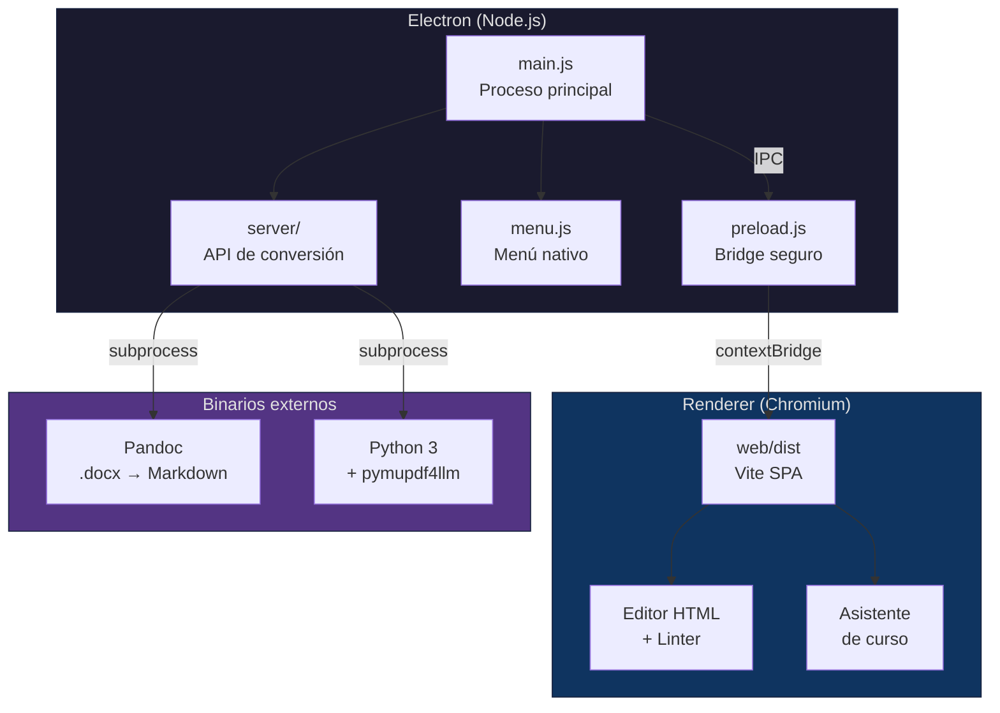
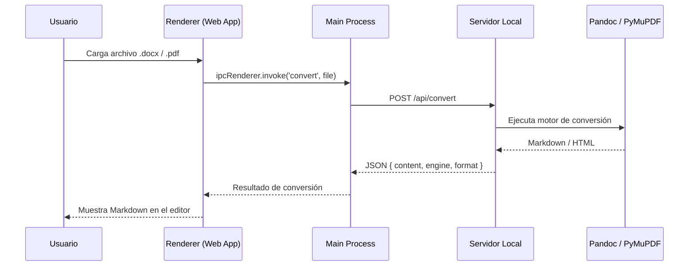

# GEO Engine Desktop

Aplicación de escritorio para **GEO Engine**, el motor determinista de
maquetación de cursos Moodle para la UDES. Empaqueta la web app, el servidor de
conversión y todas las dependencias en un instalador nativo para macOS y Windows
— sin necesidad de terminal, Python ni configuración manual.

> 📋 Funcionalidades futuras planificadas: [`ROADMAP.md`](ROADMAP.md)

---

## Arquitectura



### Flujo de datos



---

## Requisitos Previos

| Requisito          | Versión mínima | Propósito                              |
| ------------------ | :------------: | -------------------------------------- |
| **Node.js**        | 18+            | Ejecución de Electron y build          |
| **npm**            | 9+             | Gestión de dependencias                |
| **Pandoc**         | 3.x            | Conversión `.docx` → Markdown          |
| **Python 3**       | 3.9+           | Motor de conversión PDF                |
| **pymupdf4llm**    | última         | Conversión `.pdf` → Markdown           |
| **pypandoc**       | última         | Wrapper Python para Pandoc             |
| **Flask**          | 3.x            | Servidor API de conversión             |

> **Nota sobre Pandoc:** se puede instalar con `brew install pandoc` (macOS),
> con el instalador oficial `.msi` (Windows), o usar el script incluido
> `scripts/download-pandoc.js` para descargar el binario directamente.

---

## Instalación

### 1. Compilar la web app

```bash
cd web
npm install
npm run build
cd ..
```

Esto genera `web/dist/` con la SPA compilada que Electron servirá.

### 2. Instalar dependencias del desktop

```bash
cd desktop
npm install
```

### 3. Instalar dependencias Python (para conversión de documentos)

```bash
pip3 install -r requirements.txt
```

> Esto instala Flask, pypandoc, pymupdf4llm y mammoth — las mismas dependencias
> que el servidor web original.

---

## Desarrollo

Ejecutar la aplicación en modo desarrollo con recarga automática:

```bash
# Desde la carpeta desktop/
npm run dev
```

Esto lanza Electron apuntando a la web compilada en `web/dist/` e inicia el
servidor de conversión embebido.

### Variables de entorno útiles

| Variable               | Descripción                              | Default       |
| ---------------------- | ---------------------------------------- | :-----------: |
| `GEO_PORT`             | Puerto del servidor de conversión        | `5001`        |
| `GEO_DEV_TOOLS`        | Abrir DevTools al iniciar (`1` / `0`)    | `0`           |

---

## Compilar para Distribución

### macOS (DMG universal)

```bash
npm run build:mac
```

Genera un archivo `.dmg` en `desktop/release/` con soporte para Intel y Apple
Silicon (arquitectura universal).

### Windows (instalador NSIS)

```bash
npm run build:win
```

Genera un instalador `.exe` en `desktop/release/` con opciones de instalación
personalizables (directorio, accesos directos, etc.).

> La configuración del build se encuentra en
> [`electron-builder.yml`](electron-builder.yml).

---

## Estructura del Proyecto

```
geo-engine/
├── desktop/                    ← 📦 Aplicación Electron
│   ├── main.js                 # Proceso principal de Electron
│   ├── preload.js              # Bridge seguro (contextBridge)
│   ├── menu.js                 # Menú nativo de la aplicación
│   ├── package.json            # Dependencias y scripts de Electron
│   ├── electron-builder.yml    # Configuración de empaquetado
│   ├── server/                 # Servidor de conversión embebido
│   │   └── convert_pdf.py      # Script Python para PDF → Markdown
│   ├── assets/                 # Iconos de la aplicación
│   │   ├── icon.png            # Icono macOS (512×512)
│   │   └── icon.ico            # Icono Windows
│   ├── scripts/                # Scripts de utilidad
│   │   └── download-pandoc.js  # Descarga binario de Pandoc
│   ├── README.md               # ← Este archivo
│   └── ROADMAP.md              # Funcionalidades futuras
│
├── web/                        ← 🌐 Frontend (Vite SPA)
│   ├── src/                    # Código fuente del frontend
│   ├── dist/                   # Build compilado (generado)
│   └── package.json
│
├── geo_engine/                 ← 🔧 Motor de reglas (Python)
│   └── rules/                  # Reglas del linter
│
├── skills/                     ← 📝 Prompts genéricos para la IA
│   └── generic/                # *-prompt.md (un archivo por sección)
│
├── config/                     ← ⚙️ Configuración por curso
│   └── course.yaml
│
├── server.py                   ← 🖥️ Servidor web original (Flask)
├── cli.py                      ← ⌨️ CLI del linter
└── requirements.txt            ← 📋 Dependencias Python
```

---

## Motores de Conversión

GEO Engine soporta múltiples motores de conversión según el tipo de documento:

| Formato de entrada | Motor            | Formato de salida | Descripción                                          |
| :----------------: | :--------------: | :---------------: | ---------------------------------------------------- |
| `.docx`            | **Pandoc**       | Markdown (GFM)    | Motor por defecto. Produce GitHub-Flavored Markdown con tablas y formato limpio. |
| `.docx`            | **Mammoth**      | HTML               | Motor alternativo. Trasplanta el documento a HTML semántico directamente.        |
| `.pdf`             | **PyMuPDF4LLM**  | Markdown           | Respeta columnas y tablas del PDF. Ideal para documentos académicos complejos.   |

### Selección del motor

- **Archivos `.docx`**: Pandoc por defecto. Se puede seleccionar Mammoth
  mediante el parámetro `engine=mammoth` en la API.
- **Archivos `.pdf`**: PyMuPDF4LLM automáticamente (es el único motor
  disponible para PDF).

---

## Scripts Disponibles

| Script            | Comando                | Descripción                             |
| ----------------- | ---------------------- | --------------------------------------- |
| `dev`             | `npm run dev`          | Inicia Electron en modo desarrollo      |
| `build:mac`       | `npm run build:mac`    | Compila DMG para macOS (universal)      |
| `build:win`       | `npm run build:win`    | Compila instalador NSIS para Windows    |
| `download-pandoc` | `node scripts/download-pandoc.js` | Descarga binario de Pandoc   |

---

## Funcionalidades Futuras

Consulta [`ROADMAP.md`](ROADMAP.md) para ver la hoja de ruta completa con todas
las funcionalidades planificadas:

- 🧩 **Gestor de Skills** — interfaz visual para crear y editar skills
- 📁 **Gestión de Workspace** — abrir carpetas de curso como proyectos completos
- 🧹 **El Saneador** — automatización de limpieza del sistema de archivos
- ↕️ **Drag & Drop Avanzado** — reorganización visual de secciones HTML
- 🔗 **Link Resolver** — mapeador de enlaces e IDs con detección de enlaces rotos
- ✅ **Linter One-Click** — dashboard de validación masiva con reportes PDF

---

## Licencia

Copyright © 2026 GEO Engine. Todos los derechos reservados.
